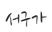
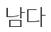

# Optical Character Recognition(OCR)
---

## 1. Preprocessing
- download link: http://www.aihub.or.kr/aidata/133
```python
with open('./data/printed_data_info.json',encoding='utf-8') as f:
    data = json.load(f)
images = pd.DataFrame(data['images'])
images = images.set_index('id').drop(columns='date_captured')
annotations = pd.DataFrame(data['annotations'])
annotations = annotations.set_index('id').drop(columns='image_id')
data = pd.merge(images, annotations ,left_index=True, right_index=True,how='left')
```


- create lmdb file
```python
!python3 ./deep-text-recognition-benchmark/create_lmdb_dataset.py \
--inputPath ./data \
--gtFile ./data/train_gt.txt \
--outputPath ./data/data_lmdb/training
```
---
## 2. TRGD
						
								

   ```python
   !python ./trdg/run.py \
   --output_dir ./trdg/data/training/ \
   --language 'ko' \
   --count 10 \
   --length 1\
   --background 1\
   --name_format 2 \
   --font_dir ./trdg/fonts/ko/ \
   --dict ./trdg/dicts/ko.txt
   ```
---
## 3. Train OCR Model

   ```python
   !CUDA_VISIBLE_DEVICES=0 python3 train.py \
   --train_data /content/drive/'Shared drives'/'BigDATA TEAM 10'/ocr/data/training \
   --valid_data /content/drive/'Shared drives'/'BigDATA TEAM 10'/ocr/data/validation \
   --workers 4 \
   --num_iter 2000 \
   --valInterval 30000 \
   --manualSeed 9999 \
   --Transformation TPS \
   --FeatureExtraction VGG \
   --SequenceModeling BiLSTM \
   --Prediction Attn
   '''
   Transformation            None|TPS
   FeatureExtraction         VGG|RCNN|ResNet
   SequenceModeling          None|BiLSTM
   Prediction                CTC|Attn
   '''
   ```
---
## 4. Detection Text in Image File


```python
!python ./text_detection/test.py \
--eval_data ./data/data_lmdb/ \
--benchmark_all_eval \
--Transformation TPS \
--FeatureExtraction VGG \
--SequenceModeling BiLSTM \
--Prediction Attn \
--saved_model ./saved_models/best_accuracy.pth \
--data_filtering_off \
--workers 4
```
---
## 5. Text Structure
### - Split line

   ```python
line_list = []
text_size = df['text_size'].mean()
start = len(line_list)
for _ in range(len(df)):
    x1,y1,x2,y2,x3,y3,x4,y4,text_size = df.loc[_]
    box = x1,y1,x2,y2,x3,y3,x4,y4
    
    idx = 0
    
    if _ ==0:
        li = []
        li.append(box)
        line_list.append(li)
            
    for line in line_list[start:]:
        do_append = 'F'
        if _ ==0:
            break
        for i in line:
            if (abs(((y1 + y3) /2) - ((i[1] + i[5])/2)) < text_size):
                line.append(box)
                line.sort()
                do_append = 'T'
                break    
        if do_append == 'T':
            break
        else:
            idx += 1

    if idx == len(line_list[start:]):
        new_line = []
        new_line.append(box)
        line_list.append(new_line)   
   ```
   ### - Split Paragraph
   ```python
before_x_point = 0
before_y_point = 0
text_structure = []
idx = 0
for line in line_list:
    if idx ==0:
        new_paragraph = []
        new_paragraph.append(line)
    
    else:
        if (line[0][1] - before_y_point) > 1.5 *text_size:
            text_structure.append(new_paragraph)
            new_paragraph = []
            new_paragraph.append(line)
        else:
            new_paragraph.append(line)
         
    before_x_point = line[0][0]
    before_y_point = line[0][1]
         
    before_x_point = line[0][0]
    before_y_point = line[0][1]
    idx += 1
    
    if idx == len(line_list):
        text_structure.append(new_paragraph)
   ```
### - Save image

   ```python
img = Image.open('./text_detection/test/test2/test2.jpg','r')
a = 0
k = 0
for paragraph in text_structure:
    path = './text_detection/result/test2_structure/'
    paragraph_path = path + 'paragraph' + str(k) + '/'
    os.mkdir(paragraph_path)
    for line in paragraph:
        line.sort()
        line_path = paragraph_path + 'line' + str(a) + '/'
        os.mkdir(line_path)
        b = 0
        for box in line:
            x1,y1,x2,y2,x3,y3,x4,y4 = box
            image = img.crop((x1,y1,x3,y3))
            image.save(line_path + str(b) +'.jpg')
            b += 1
        a += 1
    k += 1
   ```
## 6. Text Recognition Result

   ```python
output = !CUDA_VISIBLE_DEVICES=0 python3 ./deep-text-recognition/text_recognition.py \
--Transformation TPS \
--FeatureExtraction VGG \
--SequenceModeling BiLSTM \
--Prediction Attn \
--image_folder ./test \
--saved_model ./saved_model/best_accuracy.pth;
<<<<<<< HEAD
   ```
=======
   ```
=======
### Optical Character Recognition
>>>>>>> 82bed04080f4f9284ddd67123f595fdbde56ee29
