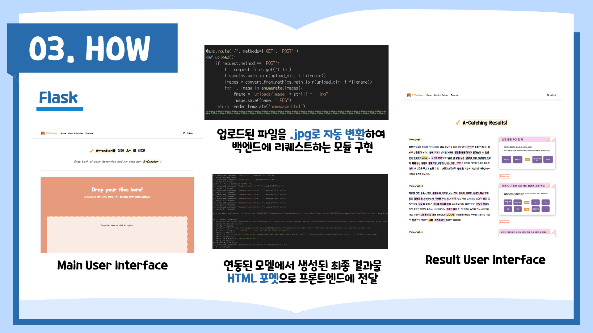

# Flask

---
## app.py
```python
app = Flask(__name__)
run_with_ngrok(app)

basedir = '/content/drive/Shared drives/BigDATA TEAM 10/dataCampusProject-Team10/flask' 
upload_dir = os.path.join(basedir, 'uploads')  # basedir 의 uploads 에 파일 저장
############################################################################################################

admin = Admin(name='Uploaded Files')
admin.init_app(app) 
dropzone = Dropzone(app)
admin.add_view(FileAdmin(upload_dir, name='FILES')) 
app.config['DROPZONE_ALLOWED_FILE_CUSTOM'] = True
app.config['DROPZONE_ALLOWED_FILE_TYPE'] = 'image/*, .pdf, .txt'
############################################################################################################

@app.route("/", methods=['GET', 'POST'])
def upload():
    if request.method == 'POST':
        f = request.files.get('file')
        f.save(os.path.join(upload_dir, f.filename))
        images = convert_from_path(os.path.join(upload_dir, f.filename))
        for i, image in enumerate(images):
            fname = "uploads/image" + str(i) + ".jpg"
            image.save(fname, "JPEG")
    return render_template('homepage.html')
##############################################################################

with open(os.path.join(basedir, 'result.txt'), 'r', encoding="UTF-8") as file:
    string = file.readlines()
with open(os.path.join(basedir, "relation.txt"), 'r', encoding="UTF-8") as file:
    relation = file.read()
relation = [i for i in relation.split('\n\n') if i]
with open(os.path.join(basedir, "templates/result_1.html"), "r", encoding="UTF-8") as file:
    result_1 = file.read()
with open(os.path.join(basedir, "templates/result_1_1.html"), "r", encoding="UTF-8") as file:
    result_1_1 = file.read()
with open(os.path.join(basedir, "templates/result_1_2.html"), "r", encoding="UTF-8") as file:
    result_1_2 = file.read()
with open(os.path.join(basedir, "templates/result_1_3.html"), "r", encoding="UTF-8") as file:
    result_1_3 = file.read()
with open(os.path.join(basedir, "templates/result_1_4.html"), "r", encoding="UTF-8") as file:
    result_1_4 = file.read()
with open(os.path.join(basedir, "templates/result_1_5.html"), "r", encoding="UTF-8") as file:
    result_1_5 = file.read()

utils.save_pptx_as_png("/content/drive/'Shared drives'/'BigDATA TEAM 10'/dataCampusProject-Team10/flask/outputs", "/content/drive/'Shared drives'/'BigDATA TEAM 10'/dataCampusProject-Team10/flask/slides.pptx", overwrite_folder=True)


for i in range(1, len(string)):
    result_1 += ("<div class='col-md-7'><hr><div class='row-eq-height'><div class='col-md-12' style='line-height: 40px'><p class='dark-grey-text'><mark><strong>Paragraph " + str(i) + "</strong></mark></p><a style='line-height: 40px'>")
    result_1 += string[i] # paragraph
    result_1 += result_1_1
    result_1 += ("")  # ppt slide picture
    # result_1 += ("")
    result_1 += result_1_2
    result_1 += ("<button type='button' class='btn-outline-deep-orange' data-toggle='modal' data-target='#P" + str(i) + "'>Relation</button><div class='modal' id='P" + str(i) + "'>")  # relation tagging modal
    result_1 += result_1_3
    result_1 += relation[i-1]  # relation tagging input
    result_1 += result_1_4
result = result_1 + result_1_5
with open(os.path.join(basedir, "templates/final_result.html"), "w", encoding="UTF-8") as file:
    file.write(result)


@app.route("/result", methods=['GET', 'POST'])
def upload2():
    if request.method == 'POST':
        f = request.files.get('file')
        f.save(os.path.join(upload_dir, f.filename))
    return render_template('final_result.html')

###########################################################################################################
if __name__ == '__main__':
    app.run()
```
## HTML

### - Home Page



```html
<!DOCTYPE html>
<html lang="en">

<head>
    <meta charset="utf-8">
    <meta name="viewport" content="width=device-width, initial-scale=1, shrink-to-fit=no">
    <meta http-equiv="x-ua-compatible" content="ie=edge">
    <title>A-Catcher</title>
    <!-- Font Awesome -->
    <link rel="stylesheet" href="https://use.fontawesome.com/releases/v5.11.2/css/all.css">
    <!-- Bootstrap core CSS -->
    <link href="../static/css/bootstrap.min.css" rel="stylesheet">
    <!-- Material Design Bootstrap -->
    <link href="../static/css/mdb.min.css" rel="stylesheet">
    <!-- Your custom styles (optional) -->
    <link href="../static/css/style.min.css" rel="stylesheet">
    <link href="https://fonts.googleapis.com/css2?family=Do+Hyeon&family=Jua&display=swap" rel="stylesheet">
</head>

<body>

<!--Main Navigation-->
<header>

    <!-- Navbar -->
    <nav id="scroll" class="navbar fixed-top navbar-expand-lg navbar-light white scrolling-navbar">
        <div class="container" style="font-family: 'Do Hyeon',sans-serif">

            <!-- Brand -->
            <a class="navbar-brand waves-effect" href="/">
                
                <strong class="orange-text">A-Catcher</strong>
            </a>

            <!-- Collapse -->
            <button class="navbar-toggler" type="button" data-toggle="collapse" data-target="#navbarSupportedContent"
                    aria-controls="navbarSupportedContent" aria-expanded="false" aria-label="Toggle navigation">
                <span class="navbar-toggler-icon"></span>
            </button>

#########################################################################################################################################
          
                                                                <...>

#########################################################################################################################################
            
            
</header>

<!--Main Navigation-->

<!--Main layout-->
<main class="mt-5 pt-5">
    <div class="container">
        <section class="wow fadeIn">

            <!--Section heading-->
            <h2 class="h1 text-center my-5 font-weight-bold" style="font-family: 'Do Hyeon',sans-serif">
                
                <mark>A-Catching Results!</mark>
            </h2>
        </section>


        <!--Grid row-->
        <div class="row text-left" style="font-family: 'Jua',sans-serif; font-size: large">
```
